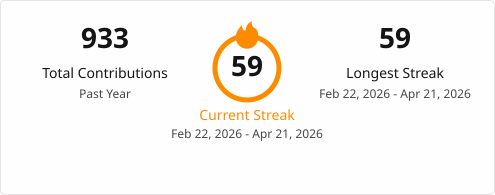
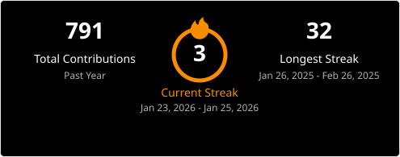
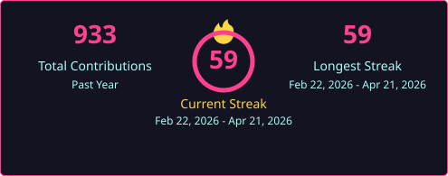
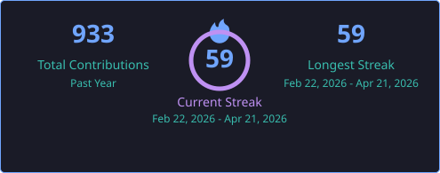
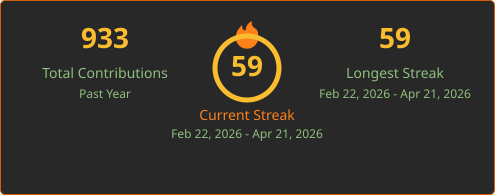
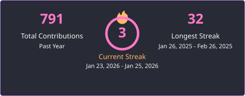
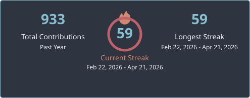
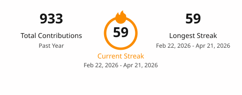

# GitHub Streak Stats Action

[](https://github.com/be-next/github-streak-stats-action/actions/workflows/generate-docs.yml)
[](https://github.com/be-next/github-streak-stats-action/releases)
[](https://opensource.org/licenses/MIT)
[](https://github.com/be-next/github-streak-stats-action/commits/main)

Generate streak stats SVG for your GitHub profile README.



## Features

- Total contributions count
- Current streak (consecutive days with contributions)
- Longest streak
- Multiple themes (default, dark, radical, tokyonight, gruvbox, dracula, nord)
- Custom color overrides
- Light/dark mode support

## Usage

```yaml
name: Update Streak Stats

on:
  schedule:
    - cron: '0 0 * * *' # Daily
  workflow_dispatch:

jobs:
  update-streak:
    runs-on: ubuntu-latest
    permissions:
      contents: write
    steps:
      - uses: actions/checkout@v6

      - name: Generate streak stats (light)
        uses: be-next/github-streak-stats-action@v1
        with:
          username: ${{ github.repository_owner }}
          token: ${{ secrets.GITHUB_TOKEN }}
          output-path: profile/streak-light.svg
          theme: default
          hide-border: true

      - name: Generate streak stats (dark)
        uses: be-next/github-streak-stats-action@v1
        with:
          username: ${{ github.repository_owner }}
          token: ${{ secrets.GITHUB_TOKEN }}
          output-path: profile/streak-dark.svg
          theme: dark
          hide-border: true

      - name: Commit changes
        run: |
          git config user.name "github-actions"
          git config user.email "github-actions@users.noreply.github.com"
          git add profile/*.svg
          git commit -m "Update streak stats" || exit 0
          git push
```

## Inputs

| Input | Description | Required | Default |
|-------|-------------|----------|---------|
| `username` | GitHub username | Yes | - |
| `token` | GitHub token for API access | Yes | - |
| `output-path` | Path to save the SVG | No | `streak-stats.svg` |
| `theme` | Theme name (`default`, `dark`, `radical`, `tokyonight`, `gruvbox`, `dracula`, `nord`) | No | `default` |
| `timezone` | IANA timezone used to resolve "today" and "yesterday" for the current streak (e.g. `Europe/Paris`, `America/New_York`) | No | `UTC` |
| `hide-border` | Hide card border | No | `false` |

### Custom Colors

Override any theme color using these inputs (hex values without `#`):

| Input | Description |
|-------|-------------|
| `background` | Card background |
| `stroke` | Border color |
| `ring` | Ring around current streak |
| `fire` | Fire icon color |
| `currStreakNum` | Current streak number |
| `sideNums` | Side numbers (total/longest) |
| `currStreakLabel` | Current streak label |
| `sideLabels` | Side labels |
| `dates` | Date range text |

## Outputs

| Output | Description |
|--------|-------------|
| `total-contributions` | Total contributions count |
| `current-streak` | Current streak in days |
| `current-streak-start` | Start date of the current streak (`YYYY-MM-DD`), empty if no active streak |
| `current-streak-end` | End date of the current streak (`YYYY-MM-DD`), empty if no active streak |
| `longest-streak` | Longest streak in days |
| `longest-streak-start` | Start date of the longest streak (`YYYY-MM-DD`), empty if zero |
| `longest-streak-end` | End date of the longest streak (`YYYY-MM-DD`), empty if zero |

## Themes

### default


### dark


### radical


### tokyonight


### gruvbox


### dracula


### nord


## Options

### hide-border


## License

MIT
